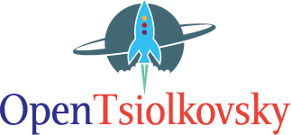

# OpenTsiolkovsky   [](https://github.com/istellartech/OpenTsiolkovsky/actions)



OpenTsiolkovsky is a modern rocket flight simulator with command-line and web interfaces, implemented primarily in Rust with a legacy C++ reference implementation.

## Key Features

* **Rocket Simulation**: Three-degree-of-freedom and six-degree-of-freedom flight simulation with attitude control (TVC)
* **Multi-Platform**:
  - **Rust implementation**: Main simulation engine with CLI and WASM support
  - **Command-line interface (CLI)**: Fast native execution
  - **Modern React/TypeScript web frontend**: Interactive visualization
  - **WASM support**: Browser-based simulation
  - **Legacy C++ implementation**: Reference implementation in `legacy_cpp/`
* **Multi-Stage Support**: Supports up to three rocket stages
* **Trajectory Analysis**: Sub-orbital and low Earth orbit trajectories
* **Data Export**: CSV and JSON output formats
* **Real-time Visualization**: Interactive 3D trajectory viewer and performance graphs

## Quick Start

### Prerequisites
- Rust (stable) + Cargo
- Bun v1+ (https://bun.sh/)
- Optional: wasm-pack for WASM builds

### Command Line Usage
```bash
# Build and run the Rust CLI
cargo run --bin openTsiolkovsky-cli -- --config examples/param_sample_01.json --verbose

# Or build release version
cargo build --release
./target/release/openTsiolkovsky-cli --config examples/param_sample_01.json --output my_result
```

### Frontend Development
```bash
cd frontend
bun install
bun run dev
# Open http://localhost:5173 in your browser
```

### WASM Build
```bash
# Install wasm-pack if not already installed
# cargo install wasm-pack

# Build WASM package for frontend
./scripts/wasm_build.sh
```

## Project Structure
```
OpenTsiolkovsky/
├── src/              # Main Rust implementation
├── tests/            # Rust integration tests
├── examples/         # Configuration files and sample data
├── frontend/         # React/TypeScript web interface
├── legacy_cpp/       # Legacy C++ implementation (reference)
├── scripts/          # Build scripts (WASM, etc.)
└── docs/             # Documentation
```

## Documentation
- [Quick Start](docs/quick-start.md)
- [Development guide](docs/development.md)
- [WASM build](docs/wasm.md)
- [Configuration file](docs/configuration.md)
- [Legacy C++ Implementation](legacy_cpp/)

Read more about it on the [Wiki](https://github.com/istellartech/OpenTsiolkovsky/wiki)

Input file format is following [input file format](https://github.com/istellartech/OpenTsiolkovsky/wiki/input_file)

## License
OpenTsiolkovsky is an Open Source project licensed under the MIT License
