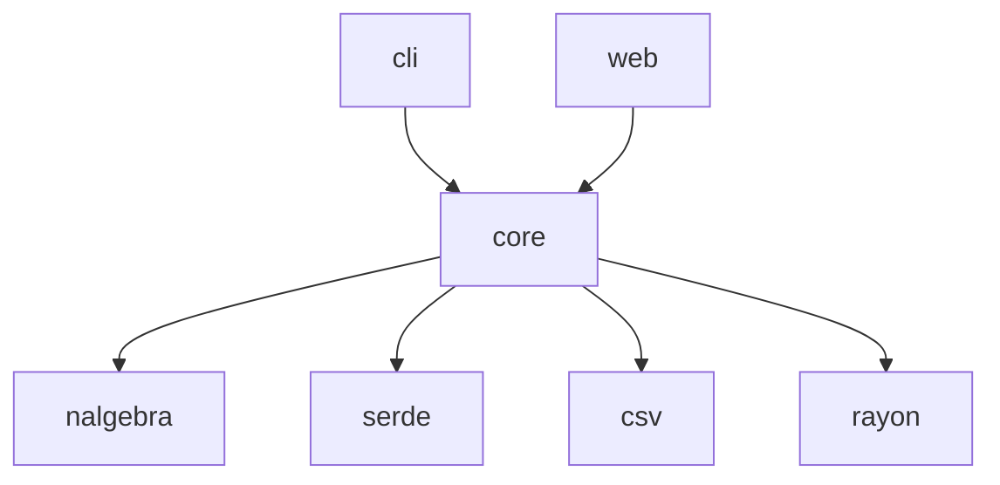

# OpenTsiolkovsky Rust移植 設計書

## 1. システム概要

### 1.1 アーキテクチャ概要
```
┌─────────────────┐    ┌──────────────────┐    ┌─────────────────┐
│   Web Frontend  │    │   API Server     │    │  Core Simulator │
│  (TypeScript)   │◄──►│    (Rust)        │◄──►│     (Rust)      │
│                 │    │                  │    │                 │
│ - React + TS    │    │ - axum           │    │ - Physics       │
│ - Three.js      │    │ - WebAssembly    │    │ - Mathematics   │
│ - Chart.js      │    │ - File I/O       │    │ - Simulation    │
│ - shadcn/ui     │    │                  │    │                 │
└─────────────────┘    └──────────────────┘    └─────────────────┘
```

### 1.2 現行システムマッピング

| 現行C++モジュール | Rust移植先 | 責務 |
|-------------|----------|------|
| `main.cpp` | `cli` | エントリーポイント + WASM |
| `rocket.cpp/.hpp` | `core::simulator` | メインシミュレータ |
| `air.cpp/.hpp` | `core::physics::atmosphere` | 大気モデル |
| `gravity.cpp/.hpp` | `core::physics::gravity` | 重力モデル |
| `coordinate_transform.cpp/.hpp` | `core::physics::coordinates` | 座標変換 |
| `Orbit.cpp/.hpp` | `core::simulator` | 軌道計算（統合） |
| `fileio.cpp/.hpp` | `core::io` | ファイル入出力 |

## 2. Rustプロジェクト構成

### 2.1 シンプルなWorkspace構成
```
openTsiolkovsky-rust/
├── Cargo.toml              # Workspace定義
├── README.md
├── docs/                   # ドキュメント
├── examples/               # 使用例
├── tests/                  # 結合テスト
│
├── crates/
│   ├── core/               # コア（物理・数学・IO統合）
│   ├── cli/                # CLI + WASM bindgen
│   └── web/                # API サーバー
│
└── frontend/               # React フロントエンド
    ├── package.json        # bun使用
    ├── src/
    │   ├── components/
    │   ├── lib/            # ユーティリティ・型定義
    │   └── App.tsx
    └── public/
```

### 2.2 依存関係（簡潔化）


## 3. Core Crate設計

### 3.1 モジュール構成
```rust
// core/src/lib.rs
pub mod simulator;   // メインシミュレータ
pub mod physics;     // 物理モデル（大気・重力・座標変換）
pub mod rocket;      // ロケット・ステージ定義
pub mod io;          // ファイル入出力
pub mod math;        // 数学ユーティリティ（Runge-Kutta4等）

pub use simulator::Simulator;
pub use rocket::{Rocket, RocketConfig};

// 主要な依存crate
use nalgebra::{Vector3, Quaternion};
use serde::{Serialize, Deserialize};
```

### 3.2 Simulatorトレイト設計
```rust
pub struct Simulator {
    config: RocketConfig,
    rocket: Rocket,
    physics: PhysicsEngine,
    integrator: RungeKutta4,
    state: SimulationState,
    trajectory: Vec<SimulationState>,
}

#[derive(Debug, Clone, Serialize, Deserialize)]
pub struct SimulationState {
    pub time: f64,
    pub position: Vector3<f64>,  // ECI座標
    pub velocity: Vector3<f64>,  // ECI座標
    pub mass: f64,
    pub stage: u8,
}

impl Simulator {
    pub fn new(config: RocketConfig) -> Result<Self, SimError> { /* ... */ }
    pub fn run(&mut self) -> Vec<SimulationState> { /* ... */ }
    pub fn step(&mut self, dt: f64) { /* ... */ }
    pub fn current_state(&self) -> &SimulationState { /* ... */ }
}
```

### 3.3 物理エンジン（統合）
```rust
// core/src/physics/mod.rs
pub mod atmosphere;
pub mod gravity;
pub mod coordinates;

pub struct PhysicsEngine {
    pub atmosphere: AtmosphereModel,
    pub gravity: GravityModel,
    pub coords: CoordinateTransform,
}

// core/src/physics/atmosphere.rs
pub struct AtmosphereModel {
    height_layers: [f64; 8],
    lapse_rates: [f64; 8],
    base_temperatures: [f64; 8],
    base_pressures: [f64; 8],
}

impl AtmosphereModel {
    pub fn density(&self, altitude: f64) -> f64 { /* ISA計算 */ }
    pub fn pressure(&self, altitude: f64) -> f64 { /* ... */ }
    pub fn temperature(&self, altitude: f64) -> f64 { /* ... */ }
}
```

### 3.4 IO処理（統合）
```rust
// core/src/io/mod.rs
use std::error::Error;
use std::path::Path;

#[derive(Serialize, Deserialize, Debug)]
pub struct RocketConfig {
    pub name: String,
    pub calculate_condition: CalculateCondition,
    pub launch: LaunchCondition,
    pub stages: Vec<StageConfig>,
    pub wind: WindConfig,
}

pub fn load_config(path: &Path) -> Result<RocketConfig, Box<dyn Error>> {
    let content = std::fs::read_to_string(path)?;
    Ok(serde_json::from_str(&content)?)
}

pub fn load_csv_data(path: &Path) -> Result<Vec<(f64, f64)>, Box<dyn Error>> {
    // CSV読み込み処理
}
```

### 3.5 数学ライブラリ（自作Runge-Kutta4）
```rust
// core/src/math/integrator.rs
pub struct RungeKutta4;

impl RungeKutta4 {
    pub fn integrate<F>(&self, y: &mut [f64], t: f64, dt: f64, f: F) 
    where F: Fn(f64, &[f64]) -> Vec<f64> {
        let k1 = f(t, y);
        let y1: Vec<f64> = y.iter().zip(&k1).map(|(y, k)| y + 0.5 * dt * k).collect();
        
        let k2 = f(t + 0.5 * dt, &y1);
        let y2: Vec<f64> = y.iter().zip(&k2).map(|(y, k)| y + 0.5 * dt * k).collect();
        
        let k3 = f(t + 0.5 * dt, &y2);
        let y3: Vec<f64> = y.iter().zip(&k3).map(|(y, k)| y + dt * k).collect();
        
        let k4 = f(t + dt, &y3);
        
        for i in 0..y.len() {
            y[i] += dt * (k1[i] + 2.0 * k2[i] + 2.0 * k3[i] + k4[i]) / 6.0;
        }
    }
}
```

## 4. CLI + WASM Crate設計

### 4.1 CLI部分
```rust
// cli/src/main.rs
use clap::Parser;
use core::{Simulator, load_config};

#[derive(Parser)]
struct Args {
    #[arg(short, long, default_value = "param_sample.json")]
    config: String,
}

fn main() -> Result<(), Box<dyn std::error::Error>> {
    let args = Args::parse();
    let config = load_config(&args.config.into())?;
    let mut simulator = Simulator::new(config)?;
    
    let trajectory = simulator.run();
    
    // CSV出力
    for state in trajectory {
        println!("{},{},{},{}", 
            state.time, state.position.x, state.position.y, state.position.z);
    }
    
    Ok(())
}
```

### 4.2 WASM Bindgen部分
```rust
// cli/src/wasm.rs
use wasm_bindgen::prelude::*;
use core::{Simulator, RocketConfig};

#[wasm_bindgen]
pub struct WasmSimulator {
    inner: Simulator,
}

#[wasm_bindgen]
impl WasmSimulator {
    #[wasm_bindgen(constructor)]
    pub fn new(config_json: &str) -> Result<WasmSimulator, JsError> {
        let config: RocketConfig = serde_json::from_str(config_json)
            .map_err(|e| JsError::new(&e.to_string()))?;
        let simulator = Simulator::new(config)
            .map_err(|e| JsError::new(&e.to_string()))?;
        Ok(WasmSimulator { inner: simulator })
    }
    
    #[wasm_bindgen]
    pub fn run(&mut self) -> String {
        let trajectory = self.inner.run();
        serde_json::to_string(&trajectory).unwrap()
    }
    
    #[wasm_bindgen]
    pub fn step(&mut self, dt: f64) -> String {
        self.inner.step(dt);
        let state = self.inner.current_state();
        serde_json::to_string(state).unwrap()
    }
}
```

## 5. Web API Crate設計

### 5.1 シンプルなAPI サーバー
```rust
// web/src/main.rs
use axum::{
    extract::multipart::Multipart,
    http::StatusCode,
    response::Json,
    routing::{get, post},
    Router,
};
use core::{Simulator, RocketConfig};

#[tokio::main]
async fn main() {
    let app = Router::new()
        .route("/api/simulation", post(run_simulation))
        .route("/api/upload", post(upload_config));

    axum::Server::bind(&"0.0.0.0:3001".parse().unwrap())
        .serve(app.into_make_service())
        .await
        .unwrap();
}

async fn run_simulation(Json(config): Json<RocketConfig>) -> Result<Json<Vec<SimulationState>>, StatusCode> {
    let mut simulator = Simulator::new(config).map_err(|_| StatusCode::BAD_REQUEST)?;
    let trajectory = simulator.run();
    Ok(Json(trajectory))
}
```

## 6. Frontend設計

### 6.1 ディレクトリ構成
```
frontend/
├── package.json              # bun使用
├── tailwind.config.js        # Tailwind CDN設定
├── vite.config.ts           # Vite設定
├── src/
│   ├── App.tsx              # メインアプリ
│   ├── components/
│   │   ├── SimulationPanel.tsx    # パラメータ入力 + 実行
│   │   ├── TrajectoryViewer.tsx   # 3D可視化（Three.js）
│   │   ├── GraphPanel.tsx         # 2Dグラフ（Chart.js）
│   │   └── ui/                    # shadcn/ui コンポーネント
│   └── lib/
│       ├── types.ts         # TypeScript型定義
│       ├── simulation.ts    # WASM呼び出し
│       └── utils.ts         # ユーティリティ
└── public/
    └── wasm/               # WASMファイル配置
```

### 6.2 メインコンポーネント
```typescript
// src/App.tsx
import { useState } from 'react';
import { SimulationPanel } from './components/SimulationPanel';
import { TrajectoryViewer } from './components/TrajectoryViewer';
import { GraphPanel } from './components/GraphPanel';
import { SimulationData } from './lib/types';

export default function App() {
  const [simulationData, setSimulationData] = useState<SimulationData | null>(null);
  
  return (
    <div className="min-h-screen bg-gray-50">
      <div className="container mx-auto px-4 py-8">
        <h1 className="text-3xl font-bold text-center mb-8">OpenTsiolkovsky</h1>
        
        <div className="grid grid-cols-1 lg:grid-cols-2 gap-8">
          <SimulationPanel onSimulationComplete={setSimulationData} />
          
          <div className="space-y-8">
            {simulationData && (
              <>
                <TrajectoryViewer data={simulationData} />
                <GraphPanel data={simulationData} />
              </>
            )}
          </div>
        </div>
      </div>
    </div>
  );
}
```

### 6.3 WASM統合
```typescript
// src/lib/simulation.ts
import init, { WasmSimulator } from '../wasm/openTsiolkovsky_cli';

let wasmInitialized = false;

export async function initWasm() {
  if (!wasmInitialized) {
    await init();
    wasmInitialized = true;
  }
}

export async function runSimulation(config: RocketConfig): Promise<SimulationData> {
  await initWasm();
  
  const simulator = new WasmSimulator(JSON.stringify(config));
  const result = simulator.run();
  
  return JSON.parse(result);
}
```

### 6.4 3D可視化（Three.js）
```typescript
// src/components/TrajectoryViewer.tsx
import { useEffect, useRef } from 'react';
import * as THREE from 'three';
import { SimulationData } from '../lib/types';

export function TrajectoryViewer({ data }: { data: SimulationData }) {
  const mountRef = useRef<HTMLDivElement>(null);
  
  useEffect(() => {
    if (!mountRef.current || !data) return;
    
    const scene = new THREE.Scene();
    const camera = new THREE.PerspectiveCamera(75, 800/600, 0.1, 1000);
    const renderer = new THREE.WebGLRenderer();
    renderer.setSize(800, 600);
    mountRef.current.appendChild(renderer.domElement);
    
    // 地球
    const earthGeometry = new THREE.SphereGeometry(6.371, 32, 32);
    const earthMaterial = new THREE.MeshBasicMaterial({ color: 0x4a90e2 });
    const earth = new THREE.Mesh(earthGeometry, earthMaterial);
    scene.add(earth);
    
    // 軌道線
    const points = data.trajectory.map(state => 
      new THREE.Vector3(
        state.position[0] * 1e-6,
        state.position[2] * 1e-6,
        -state.position[1] * 1e-6
      )
    );
    const geometry = new THREE.BufferGeometry().setFromPoints(points);
    const material = new THREE.LineBasicMaterial({ color: 0xff0000 });
    const line = new THREE.Line(geometry, material);
    scene.add(line);
    
    camera.position.set(20, 20, 20);
    camera.lookAt(0, 0, 0);
    
    renderer.render(scene, camera);
    
    return () => {
      mountRef.current?.removeChild(renderer.domElement);
    };
  }, [data]);
  
  return <div ref={mountRef} className="border rounded-lg" />;
}
```

## 7. ビルドシステム

### 7.1 Cargo.toml（Workspace）
```toml
[workspace]
members = ["crates/core", "crates/cli", "crates/web"]

[workspace.dependencies]
nalgebra = "0.32"
serde = { version = "1.0", features = ["derive"] }
serde_json = "1.0"
csv = "1.2"
rayon = "1.7"
```

### 7.2 Frontend（bun）
```json
{
  "name": "openTsiolkovsky-frontend",
  "private": true,
  "scripts": {
    "dev": "vite",
    "build": "tsc && vite build",
    "preview": "vite preview"
  },
  "dependencies": {
    "react": "^18.2.0",
    "react-dom": "^18.2.0",
    "three": "^0.158.0",
    "chart.js": "^4.4.0",
    "@radix-ui/react-button": "^0.1.0"
  },
  "devDependencies": {
    "@types/react": "^18.2.0",
    "@types/three": "^0.158.0",
    "typescript": "^5.2.0",
    "vite": "^5.0.0",
    "tailwindcss": "^3.3.0"
  }
}
```

## 8. テスト戦略

### 8.1 単体テスト
```rust
#[cfg(test)]
mod tests {
    use super::*;
    use approx::assert_relative_eq;
    
    #[test]
    fn test_atmosphere_density() {
        let atm = AtmosphereModel::default();
        assert_relative_eq!(atm.density(0.0), 1.225, epsilon = 1e-3);
    }
    
    #[test]
    fn test_runge_kutta4() {
        let integrator = RungeKutta4;
        let mut y = vec![1.0];
        integrator.integrate(&mut y, 0.0, 0.1, |_t, y| vec![-y[0]]);
        assert_relative_eq!(y[0], 0.9048, epsilon = 1e-3); // e^(-0.1)
    }
}
```

### 8.2 WASM統合テスト
```typescript
// frontend/tests/simulation.test.ts
import { runSimulation } from '../src/lib/simulation';

test('should run basic simulation', async () => {
  const config = {
    name: "test",
    calculate_condition: { end_time: 100, time_step: 1 },
    // ...
  };
  
  const result = await runSimulation(config);
  expect(result.trajectory).toHaveLength(100);
  expect(result.trajectory[0].time).toBe(0);
});
```

## 9. デプロイ戦略

### 9.1 開発フロー
1. **開発**: `bun dev` + `cargo watch`での並行開発
2. **ビルド**: WASM生成 + frontend build
3. **テスト**: Rust + TypeScript統合テスト
4. **デプロイ**: 静的サイト + APIサーバー

### 9.2 リリース計画
- **v0.1**: CLI版（Rust単体）
- **v0.2**: WASM統合、基本Web UI
- **v1.0**: 完全機能、最適化完了